# Modules Overview

WebSec-Audit is built around **15 independent modules**. Each module can be enabled or disabled individually with `--skip-<module>`.

---

## Module table

| # | Module | `--skip` flag | Primary tools | Key checks |
|---|--------|--------------|--------------|-----------|
| 01 | [Reconnaissance](recon.md) | `--skip-recon` | whois · dig · subfinder · amass | WHOIS · DNS · AXFR · subdomain enum · SPF/DMARC · Google Dorks |
| 02 | [Port Scanning](portscan.md) | `--skip-portscan` | nmap | Open ports · service versions · risk analysis for 20+ dangerous ports |
| 03 | [Fingerprinting](fingerprint.md) | `--skip-fingerprint` | whatweb · wafw00f | Tech stack · WAF detection · version-leaking headers |
| 04 | [SSL/TLS](ssl.md) | `--skip-ssl` | testssl.sh · sslscan · openssl | Deprecated protocols · weak ciphers · cert expiry · HSTS |
| 05 | [HTTP Headers](headers.md) | `--skip-headers` | curl | CSP · X-Frame-Options · cookies · HTTP→HTTPS redirect |
| 06 | [Dir & File Enum](dirbrute.md) | `--skip-dirbrute` | gobuster · ffuf · dirb | Directory brute-force · 40+ sensitive path probes |
| 07 | [Nikto](nikto.md) | `--skip-nikto` | nikto | Web server CVEs · misconfigurations · outdated software |
| 08 | [SQL Injection](sqli.md) | `--skip-sqli` | sqlmap | SQLi detection · exploitation · database enumeration |
| 09 | [XSS](xss.md) | `--skip-xss` | dalfox · curl | Reflected XSS · DOM-based XSS · common parameters |
| 10 | [CMS Scanning](cms.md) | `--skip-cms` | wpscan · droopescan | WordPress · Drupal · Joomla · Magento plugins/themes/users |
| 11 | [CORS](cors.md) | `--skip-cors` | curl | Wildcard · reflected origin · null origin · credentialed |
| 12 | [Open Redirect](redirect.md) | `--skip-redirect` | curl | 20 params × 10 redirect payloads |
| 13 | [SSRF](ssrf.md) | `--skip-ssrf` | curl | AWS/GCP/Azure IMDS · localhost · RFC1918 ranges |
| 14 | [Subdomain Takeover](subtakeover.md) | `--skip-subtakeover` | subjack · nuclei · dig | Dangling CNAMEs across 20+ services |
| 15 | [Nuclei](nuclei.md) | `--skip-nuclei` | nuclei | CVE templates · misconfiguration templates |

---

## Execution order

Modules run sequentially in the order listed above. The output of earlier modules (subdomain list from Module 01, open ports from Module 02) is used as input for later modules.

```mermaid
graph LR
  A[Target Info] --> B[Recon]
  B --> C[Port Scan]
  C --> D[Fingerprint]
  D --> E[SSL/TLS]
  E --> F[Headers]
  F --> G[Dir Enum]
  G --> H[Nikto]
  H --> I[SQLi]
  I --> J[XSS]
  J --> K[CMS]
  K --> L[CORS]
  L --> M[Redirect]
  M --> N[SSRF]
  N --> O[Takeover]
  O --> P[Nuclei]
  P --> Q[Reports]
```



---

## Skipping multiple modules

```bash
# Quick headers + SSL check only
./websec-audit.sh -t https://target.com \
  --skip-recon --skip-portscan --skip-fingerprint \
  --skip-dirbrute --skip-nikto --skip-sqli --skip-xss \
  --skip-cms --skip-cors --skip-redirect --skip-ssrf \
  --skip-subtakeover --skip-nuclei

# Reconnaissance only (no active scanning)
./websec-audit.sh -t https://target.com \
  --skip-portscan --skip-fingerprint --skip-ssl \
  --skip-headers --skip-dirbrute --skip-nikto \
  --skip-sqli --skip-xss --skip-cms --skip-cors \
  --skip-redirect --skip-ssrf --skip-subtakeover --skip-nuclei
```
